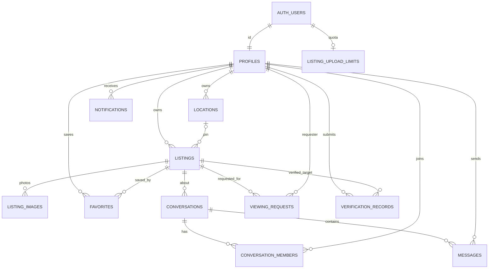

# HOMIVA database design

## Platform and migrations

Supabase Auth owns credentials and immutable auth UUIDs. `public.profiles` is the application profile keyed to `auth.users.id`; there is no second password or credentials table. PostgreSQL stores structured application data, private owner coordinates, and per-user message/viewing state. Image bytes live in private Supabase Storage buckets; `listing_images` stores only object paths and metadata.

Apply the SQL files in lexical order:

1. `20261007000100_initial_homiva_schema.sql` — core relations, triggers, indexes, RLS, and storage buckets/policies.
2. `20261007000200_listing_upload_rate_limit.sql` — an `auth.uid()`-bound hourly/daily upload counter function, callable by the trusted Storage trigger only.
3. `20261007000300_private_listing_columns.sql` — removes public-role access to owner/location identifiers and adds a function that returns only the signed-in owner's own rows.
4. `20261007000400_listing_storage_rls_upload.sql` — authenticated owner-folder insertion policy for direct Storage uploads.

These are project files, not evidence of a migration already applied to a live Supabase project. No Supabase project credentials or CLI are configured in this workspace.

## Relationships

## Tables and constraints

| Relation | Purpose and key controls |
| --- | --- |
| `profiles` | Auth-linked name/avatar metadata; profile creation trigger; a user can read/update their own profile. Other participant names are visible only to conversation participants. |
| `locations` | Private address/postal fields and exact coordinates. Owner-only RLS. The listing trigger copies only a coordinate rounded to 0.01 degrees into the public listing row. |
| `listings` | Owner-provided home data, price/costs, amenities, city/area, availability, rules, contact preference, trust and publication states. Database checks bound user text, amounts, types, and coordinates. Public reads see published rows and approved columns; draft reads are owner-only. |
| `listing_images` | Listing photo metadata, generated UUID object path, WebP MIME type, byte count, alt text, and display order. The insert trigger derives the owner from the listing and checks the object is present in `listing-media`. |
| `favorites` | `(user_id, listing_id)` composite primary key prevents duplicate saves. A user can read/add/remove their own saved rows; inserts require another owner's published listing. |
| `conversations` | One conversation per listing/renter/owner. A trigger derives both participants and a title snapshot from a published listing, allows at most 10 new conversations per renter per hour, and accepts only the listing ID from the client. Listing deletion is restricted while conversation history exists. |
| `conversation_members` | One row per authorized conversation participant, role and `last_read_at`. Membership is created by a database trigger; a participant can update only their own read timestamp. |
| `messages` | Conversation, sender, server-derived sender name/email, bounded body and timestamp. RLS requires membership. A database trigger sets the sender and enforces a per-user rate limit of five messages per minute. |
| `viewing_requests` | Listing/title snapshot, requester and owner, preferred date/time, note, status and history. The insert trigger derives owner/requester/contact fields and applies a five-per-hour requester limit. RLS allows only the renter to cancel a requested entry and its owner to accept/decline it. Listing deletion is restricted when history exists. |
| `verification_records` | Owner evidence path and review state. Owners submit/read their own record; only a trusted `app_metadata.role = 'admin'` identity can review. No approval UI or verification operation is live yet. |
| `notifications` | Private event metadata for incoming messages and viewing requests, plus read state. Triggers create rows; users can read and mark only their own notifications. |
| `listing_upload_limits` | One counter per Auth user; no direct client table/function access. A security-definer Storage trigger calls an `auth.uid()`-bound function that atomically permits up to 10 uploads per UTC hour and 30 per UTC day. |

All application primary keys are UUIDs except the favorites and conversation-member composite keys. Application-owned records carry timestamps; update triggers refresh `updated_at`. Indexes cover public listing search, owner listing dashboards, amenities, availability, image order/ownership, saved listing lookup, conversations/messages, viewing queues, notifications, and verification queues.

## Authorization map

RLS is enabled on every application table. `anon` can select only published listing columns and their published photo metadata. Authenticated listing reads use the same public columns for published homes; owner/location identifier columns are revoked from direct authenticated table reads. `get_my_listings(p_listing_id)` is a `SECURITY DEFINER` function constrained by `auth.uid()` and returns only that caller's own rows, including drafts and exact owner fields. Inserts derive owner IDs from the Auth JWT, and listing-image ownership is assigned by a trigger.

Private profile, location, favorites, conversation, message, viewing, verification, notification, and upload-quota data are scoped by RLS or a narrowly constrained trusted function. Storage buckets are private. Listing image reads allow the object's owner or a public listing; listing uploads are authenticated direct Storage writes restricted to the owner's folder, and object deletion is owner-folder scoped. Profile and verification buckets have separate owner policies.

The browser checks the canvas-produced WebP bytes, obtains a random UUID path, and uploads with the authenticated user's JWT. Storage RLS restricts listing-media inserts to that user's folder and the bucket limits type/size. A `storage.objects` trigger invokes the quota function for every listing-media insert, so a client cannot skip the limit by bypassing the UI. The function derives its user from `auth.uid()` and accepts no caller-supplied user ID. The service-role key is not required for any app path.

## Deletion behavior

- Deleting an Auth user cascades dependent profile data, private locations, favorites, upload metadata, and the quota row where no restricted conversation/viewing history points at the profile. Conversation, message, viewing, and verification references intentionally restrict account deletion until a retention/anonymization workflow is implemented; the app does not currently provide account deletion.
- Listing photo metadata cascades with a listing. Conversation and viewing rows use `ON DELETE RESTRICT` so valuable contact/history is retained; unpublish a home with history. The UI reports this constraint.
- Conversation messages and memberships cascade only with their conversation. Participants cannot delete either.
- Verification records restrict listing deletion while review history exists; evidence files are private and must follow retention policy before manual deletion.

Before production, apply migrations to a fresh Supabase project, confirm each migration completes, inspect the resulting grants/RLS in the dashboard, and run two-account authorization checks against the deployed project. Those provider-side checks cannot be completed until a project exists and credentials are entered privately.
